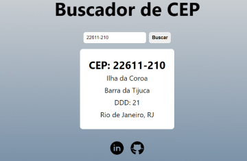

# Buscador de CEP

O objetivo desse projeto era praticar consumo de API e pegar familiaridade com o Typescript. Utilizei as seguintes linguagens, ferramentas e bibliotecas:

- React
- Typescript
- Axios
- API [ViaCep](https://viacep.com.br)
- VSCode
